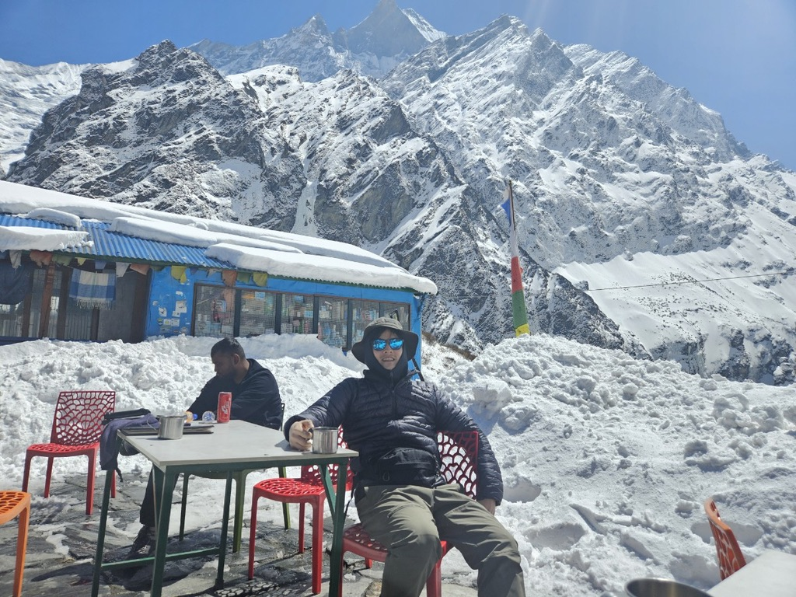

## Welcome!
I am a passionate Data Scientist with a strong background in predictive modeling and business analytics, eager to embrace new adventures and challenges. With over 6 years of experience, I have consistently delivered impactful solutions that drive decision-making and improve operational efficiency.
 

## About Me
- Data Scientist with over 6 years of expertise in business analytics and predictive modeling
- Based in Seoul, South Korea, consistently demonstrated proficiency by designing and implementing highly accurate online time estimation models for grocery shopping and food delivery services
- Played a key role in enhancing decision-making processes through the strategic design and implementation of key performance indicators (KPIs) and the integration of data governance best practices
 

## Skills

**[🚀 **Launch Interactive Skills Dashboard** 🚀](https://dkim-skills.streamlit.app)**

**Programming Language:**
-      
  
**Framework:**
-    

**MLOps:** 
-   

**Database:**
-     

**VCS:** 
-  

 

## Contact
- **Email:** [donginkim88@gmail.com](mailto:donginkim88@gmail.com)
- **LinkedIn:** [linkedin.com/in/donginkim88](https://www.linkedin.com/in/donginkim88)
- **GitHub:** [github.com/dkim949](https://github.com/dkim949)
- **Medium:** [medium.com/@donginkim88](https://medium.com/@donginkim88)

 

*A moment from my trek in the Himalayas, 2024.*