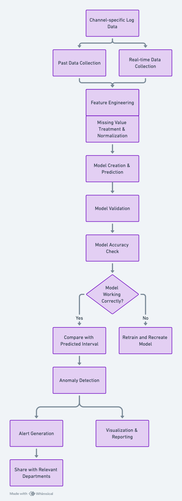

# Anomaly Detection in Transactional Data

This project involved developing an integrated system to detect anomalies in transactional data for a food delivery service. The system aimed to enhance the reliability of operations by promptly identifying and addressing system errors or failures.

## Project Overview

**Objective:** Build a system that can detect system errors and anomalies in real-time, providing instant alerts based on the severity of the detected issue.

## Key Features

**Real-Time Anomaly Detection:**
- **Data Ingestion:** Collected minutely transactional data, such as order creation, payment, and cancellations, from various sources.
- **Data Preparation:** Cleaned and normalized data by handling missing values and removing outliers to ensure consistency in the detection process.

**Modeling Approach:**
- **Statistical Forecasting:** Analyzed data distribution over time to identify normal patterns and set thresholds for anomaly detection.
  - **Thresholds:** Utilized Interquartile Range (IQR) to calculate upper and lower bounds, smoothing these thresholds using a moving average.
  - **Scoring System:** Developed a scoring mechanism to assess the severity of deviations from expected patterns, with alerts categorized into levels (GREEN, YELLOW, ORANGE, RED).
- **Custom Loss Function:** Addressed the long-tail distribution issue in transactional data by implementing a custom loss function, penalizing underestimations to minimize the impact of outliers.

**Handling Unknown Information at Detection Time:**
- **Indirect Feature Engineering:** Used historical statistical data to approximate unavailable real-time information, ensuring robust detection capabilities even with incomplete data.
- **Inductive Bias Integration:** Leveraged Multi-Task Learning (MTL) models to incorporate indirect features into the main anomaly detection task, improving the model's overall performance.

**Challenges in Business Metrics:**
- **Beyond Traditional Metrics:** Traditional metrics like precision and recall were used alongside business-specific metrics to ensure the system's relevance and effectiveness in real-world scenarios.
- **Business Metric Integration:** Collaborated with stakeholders to define and implement business metrics that align with operational goals, ensuring the system delivers actionable insights.

**Improving System Interpretability:**
- **Data Visualization:** Implemented dashboards and visualizations to help stakeholders understand the underlying causes of detected anomalies.
- **Stakeholder Engagement:** Regularly updated stakeholders through interactive sessions to ensure the system’s outputs were clear and actionable.

## Impact

**Operational Benefits:**
- **Efficiency Gains:** The anomaly detection system significantly improved response times to potential issues, reducing downtime and optimizing operational efficiency.
- **System Reliability:** By proactively identifying anomalies, the system contributed to higher reliability and stability of the delivery service's operations.

**Scalability:**
- The system was designed with scalability in mind, allowing it to adapt to different types of transactional data and expanding to other services within the company.

[Back to Home](../index.md)