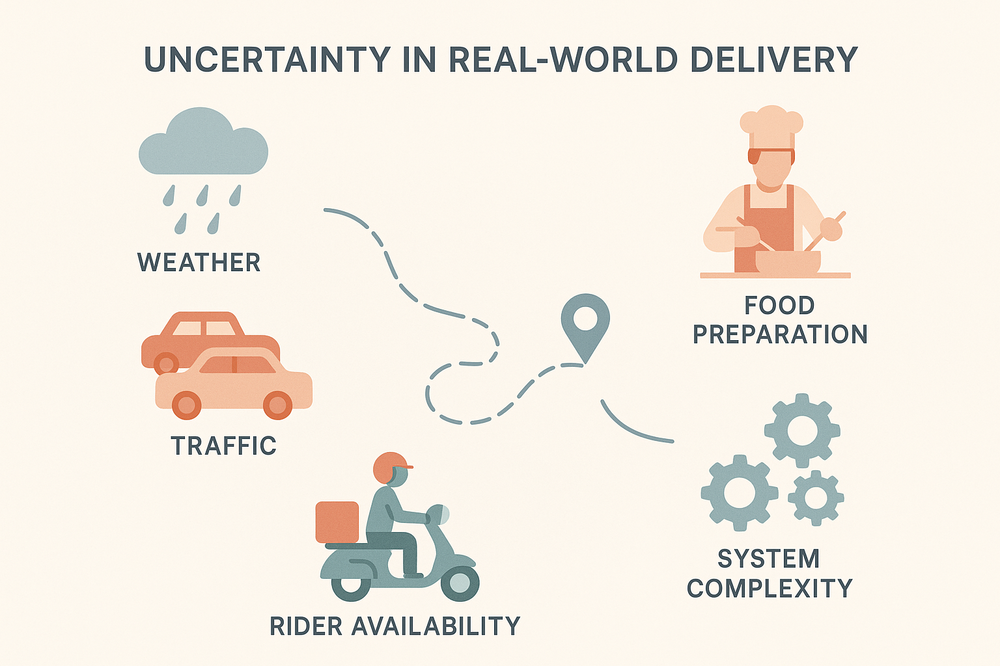
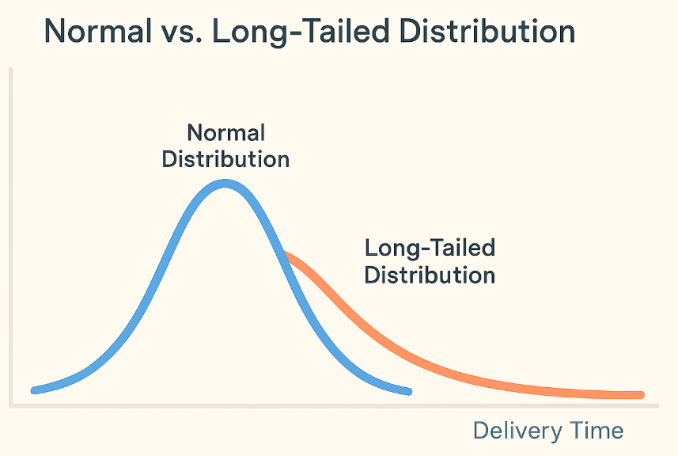
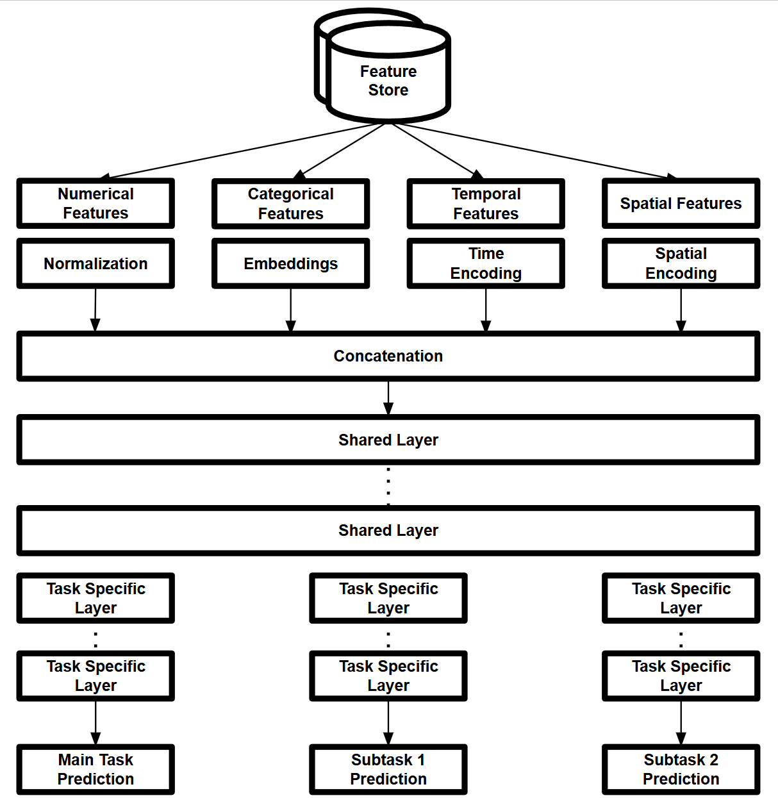
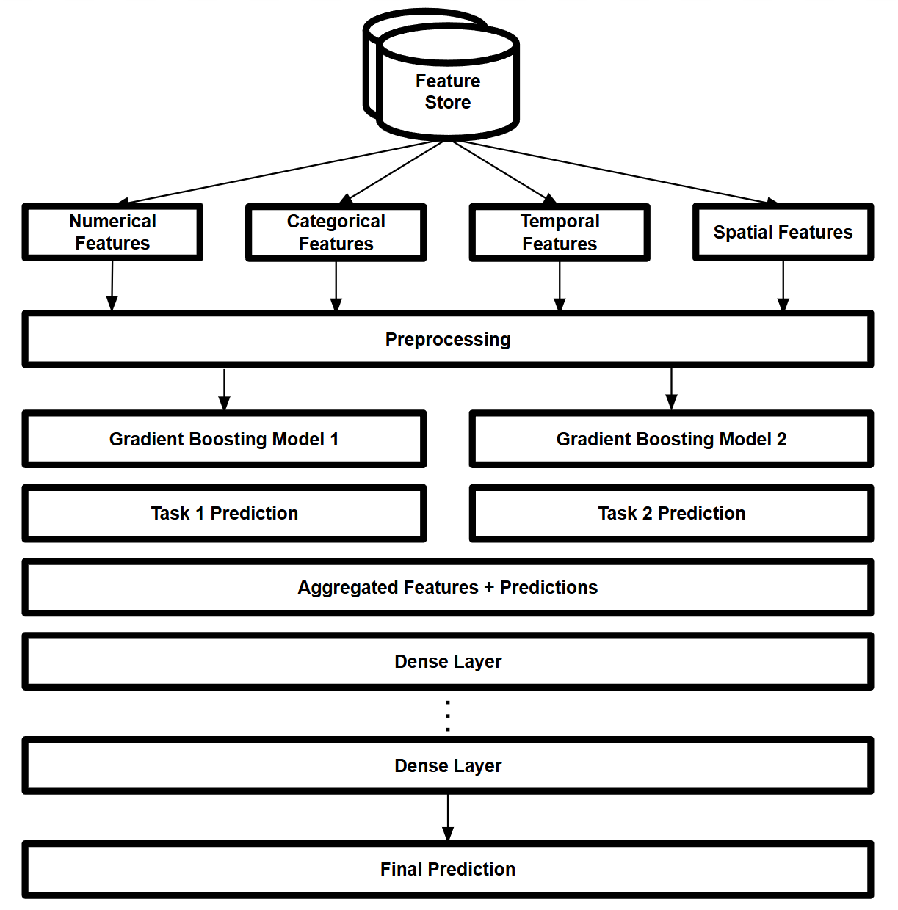

# Building a Scalable ETA Prediction System

> **Duration**: 3+ years  
> **Role**: Lead model developer and key contributor across multiple verticals  
> **Scope**: Designed and deployed multiple ML models across food, grocery, and retail services—each adapted to unique operational constraints and real-time conditions

## *“How long will it take to arrive?”*

It sounds simple. But answering this question—reliably, in real time, for millions of daily deliveries—is a deeply complex challenge.

Behind every estimate lies a network of unpredictable variables: weather, traffic, kitchen delays, rider availability, and dynamic business policies. Even with rich historical data, no two deliveries are exactly alike.

This project aimed to build ETA systems that could operate under these real-world uncertainties—offering accurate, trustworthy predictions across multiple services and contexts.

## Problem Definition

Predicting delivery times is not just a regression task—it’s a real-world decision-making problem under uncertainty.

In a high-throughput environment like food and retail delivery, our system must provide reliable time estimates *before* the key events (e.g. dispatch, pickup, and transit) have even occurred. This means we’re not just predicting one outcome, but reasoning about **many unknowns**.

### Key challenges include:

1. **Latent, dynamic variables**  
   Many important factors—like which rider will accept the order, how long a kitchen will take to prepare food, or whether it will rain in 15 minutes—are unknown at prediction time.

2. **Multi-stage dependency**  
   Delivery time is not a single quantity—it’s the sum of several sequential and conditionally dependent durations:  
   - Dispatch delay  
   - Pickup time  
   - Transit time  

   Each segment has its own features, noise, and dominant uncertainty sources.

   > $ETA = T_{dispatch} + T_{pickup} + T_{transit}$  

   [Insert: Layered bar chart showing variance in each time component]

3. **Long-tail and rare events**  

   Most deliveries follow predictable patterns, but rare events (e.g., sudden storms, local protests, major road construction) introduce heavy tails into the distribution. These outliers can seriously impact the user experience if not properly modeled.

4. **Business-aligned constraints**  
   It’s not enough to minimize mean absolute error. The prediction system must align with business constraints such as:  
   - High hit rate within promised intervals (e.g., 90% within 10-minute window)  
   - Conservative estimates under high uncertainty  
   - Operational feasibility for batching, routing, and capacity planning

## Data Analysis and Feature Engineering

My primary responsibilities in this phase included:

1. **Definition of Data Requirements**: Thoroughly evaluated and defined the data needed for the prediction models:
- Reviewed existing data sources and analyzed their relevance to prediction goals
- Identified essential data not yet collected and defined new data requirements
- Proposed designs for new data logs where necessary

2. **Assessment of Data Quality and Availability**: 
- Identified required data that was not yet being collected or recognized within the company
- Discussed implementation strategies for new data collection processes with engineering teams
- Explored alternative data sources or proxy data to supplement required information
- Performed data integrity validation to check for data pollution, inconsistencies, or anomalies

3. **Feature Engineering**: Developing service-specific feature sets based on domain knowledge and data analysis. This involved:
   - Creating time-based features (e.g., hour of day, day of week, seasonality)
   - Developing geospatial features (e.g., distance to destination, area density)
   - Engineering order-specific features (e.g., order value, item count, special requirements)
   - Crafting historical aggregates (e.g., average preparation time for a restaurant, driver performance metrics)
   - Developing real-time features to capture dynamic conditions (e.g., current traffic, live rider locations, restaurant busy status)

4. **Real-Time Feature Development**: 
   - Designed features to capture real-time conditions crucial for accurate predictions
   - Collaborated closely with our team's engineers and data-generating teams to ensure the feasibility of obtaining these features at inference time
   - Carefully evaluated each real-time feature for its predictive power and practical implementability
   - Considered both the availability of data at prediction time and the impact on overall system response time when selecting real-time features
   - Iteratively refined real-time features based on feedback from production systems and performance metrics

5. **Feature Selection**: Implementing and applying feature selection methods to identify the most predictive variables for each service, with special consideration for the trade-offs involved in using real-time features.

6. **Cross-Functional Collaboration**: Maintained ongoing communication with various stakeholders:

- Collaborated with business units and service teams to understand operational needs and align solutions
- Partnered with the data platform team to ensure feature compatibility with data infrastructure
- Engaged with engineering teams on technical implementation feasibility
- Ensured solutions were practically applicable and aligned with evolving business objectives across services

This comprehensive approach to data analysis and feature engineering was crucial to the project's success. It demanded a balance of technical expertise in data science, domain knowledge of various services, and strong collaboration skills. The ability to work effectively across different teams and disciplines, while continuously adapting to evolving business needs and technical constraints, was key to delivering impactful solutions across multiple service lines.

## Model Development

The modeling approach was tailored to the specific conditions and requirements of each service:

1. **Established Services with Complex Data**: For services with rich, complex datasets, I conducted in-depth research on a range of advanced machine learning techniques.
   - Ensemble methods, including various Gradient Boosting frameworks
   - Deep Learning architectures, such as Multi-Layer Perceptrons and Wide and Deep Networks
   - Multi-task Learning approaches to leverage information across related prediction tasks
   - Hybrid models combining tree-based methods and neural networks

   Below are two example architectures that were explored:

   
   *Multi-Task Learning Architecture: Leveraging shared representations across multiple delivery-related tasks*

   
   *Hybrid Model Architecture: Combining gradient boosting models with deep neural networks for enhanced prediction accuracy*

2. **New/Growing Services**: For newer or rapidly evolving services, I focused on more interpretable and adaptable modeling approaches.
   - Focused on simpler, more interpretable models for easier communication and reporting
   - Utilized Linear Regression with regularization
   - Explored Explainable AI (XAI) models like EBM (Explainable Boosting Machine) and Decision Trees

3. **Model Selection and Optimization Process**: 
   - Conducted extensive experimentation with various model architectures
   - Developed a robust cross-validation strategy to ensure model generalization
   - Utilized advanced hyperparameter optimization techniques (e.g., Bayesian optimization)
   - Conducted thorough model diagnostics to identify and address potential issues (e.g., overfitting, bias)

4. **Custom Loss Functions**: Developed service-specific loss functions to address unique prediction requirements and business goals.

5. **Metric Development**: Created and adjusted performance metrics to align with evolving business requirements.

6. **Flexible Model Tuning**: Designed models to be easily adjustable based on changing business priorities, going beyond traditional accuracy metrics like RMSE and MAE.

## Model Monitoring and Maintenance

Key aspects of the monitoring and maintenance phase included:

1. **Validation Logic**: Implemented robust validation processes to ensure model reliability.

2. **Automated Retraining**: Developed pipelines for automated model retraining based on performance thresholds.

3. **Alerting System**: Created an alerting system to notify of significant performance degradation.

4. **Fallback Mechanisms**: Designed fallback logic to maintain service continuity during model issues.

5. **Performance Dashboard**: Developed dashboards for stakeholders to monitor key performance indicators.

6. **A/B Testing**: Utilized existing A/B testing platforms to evaluate model improvements, with careful sample group selection based on service conditions.

7. **Stakeholder Communication**: Maintained regular dialogue with business teams to ensure model outputs remained aligned with current business goals.

## Results and Impact

- Achieved significant improvements in prediction accuracy across all services, with specific gains varying by service type.
- Substantially reduced delivery time discrepancies, leading to enhanced customer satisfaction as measured by post-delivery surveys.
- Contributed to increased on-time delivery rates, improving operational efficiency.
- Developed models that dynamically adapted to changing business priorities, ensuring ongoing relevance and impact.
- Created a framework for continuous model improvement and adaptation to new services and regions.

This project demonstrated my ability to lead complex data science initiatives that directly impact core business operations across multiple service lines. It showcased my skills in stakeholder management, advanced modeling techniques, and aligning data science solutions with dynamic business objectives.

[Back to Home](../index.md)
