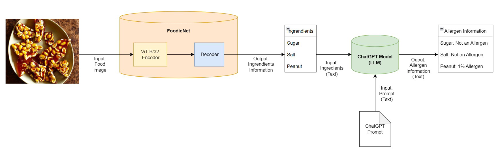

# FoodieNet - Food Image Classification Model

This project focused on developing a deep learning model for food image classification, with a novel approach to handling fine-grained visual categorization challenges in food recognition. The goal was to improve classification accuracy by effectively capturing subtle visual differences between similar food categories.

## Project Overview

- **Duration**: 4 months
- **Role**: Team member in a 4-person research project
- **Technologies**: PyTorch, ResNet-50, Vision Transformer

## Problem Statement and Approach

Food image classification presents unique challenges due to the fine-grained nature of food categories and high intra-class variations. Our approach focused on developing a novel architecture that could better capture subtle visual differences while maintaining computational efficiency.

## Technical Implementation

1. **Model Architecture**:

   
   *FoodieNet Architecture: End-to-end pipeline for food image classification and ingredient/allergen analysis*

   - Developed FoodieNet, combining CNN and Transformer architectures
   - Utilized ResNet-50 as the backbone network
   - Implemented a novel attention mechanism for fine-grained feature extraction
   - Designed a hybrid architecture leveraging both local and global features
   - Integrated with LLM for ingredient and allergen information extraction

2. **Key Components**:
   - Multi-scale feature extraction
   - Attention-based feature refinement
   - Hierarchical feature fusion
   - Category-specific feature enhancement

3. **Training Strategy**:
   - Implemented progressive training approach
   - Utilized data augmentation techniques
   - Applied transfer learning from ImageNet pre-trained models
   - Employed mixed precision training for efficiency

## Results and Impact

- Achieved 87.2% top-1 accuracy on Food-101 dataset
- Demonstrated 2.1% improvement over baseline ResNet-50
- Reduced computational complexity compared to pure transformer approaches
- Successfully handled fine-grained classification challenges in food recognition

## Key Findings

1. **Architecture Benefits**:
   - Hybrid approach effectively captured both local and global features
   - Attention mechanism improved discrimination between similar food categories
   - Multi-scale feature extraction enhanced model robustness

2. **Performance Analysis**:
   - Strong performance on visually similar food categories
   - Effective handling of intra-class variations
   - Computational efficiency suitable for practical applications

This project demonstrated the effectiveness of combining traditional CNN architectures with modern attention mechanisms for fine-grained visual classification tasks. The resulting model showed significant improvements in food image classification while maintaining practical computational requirements.

[Back to Home](../index.md)
